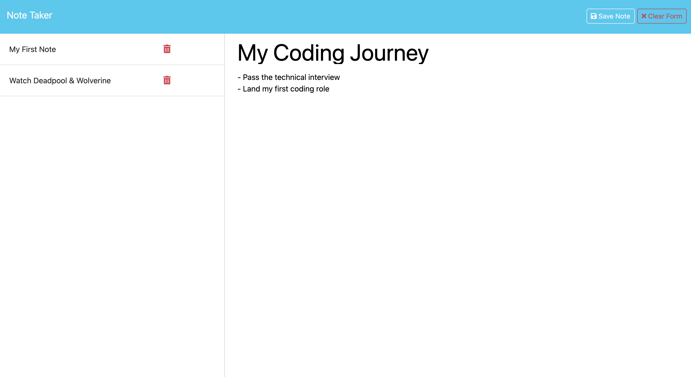

# Personal Note Taker

## Description

This project uses Express.js to write, store, and delete notes in a json file "database." This project is an introduction to api routes, and GET, POST, and DELETE http methods. The application is deployed using Render.

## Installation

- Clone to your machine
- Install dependencies

## Usage

Open the Note Taker application using the below link. Click 'Get Started' and begin adding notes!

This is the link to the deployed webpage: _https://personal-note-taker.onrender.com_

## Credits

The front end was provided by the RICE Coding Bootcamp.

## License

MIT License

Copyright (c) 2024 anullator

Permission is hereby granted, free of charge, to any person obtaining a copy of this software and associated documentation files (the "Software"), to deal in the Software without restriction, including without limitation the rights to use, copy, modify, merge, publish, distribute, sublicense, and/or sell copies of the Software, and to permit persons to whom the Software is furnished to do so, subject to the following conditions:

The above copyright notice and this permission notice shall be included in all copies or substantial portions of the Software.

THE SOFTWARE IS PROVIDED "AS IS", WITHOUT WARRANTY OF ANY KIND, EXPRESS OR IMPLIED, INCLUDING BUT NOT LIMITED TO THE WARRANTIES OF MERCHANTABILITY, FITNESS FOR A PARTICULAR PURPOSE AND NONINFRINGEMENT. IN NO EVENT SHALL THE AUTHORS OR COPYRIGHT HOLDERS BE LIABLE FOR ANY CLAIM, DAMAGES OR OTHER LIABILITY, WHETHER IN AN ACTION OF CONTRACT, TORT OR OTHERWISE, ARISING FROM, OUT OF OR IN CONNECTION WITH THE SOFTWARE OR THE USE OR OTHER DEALINGS IN THE SOFTWARE.
